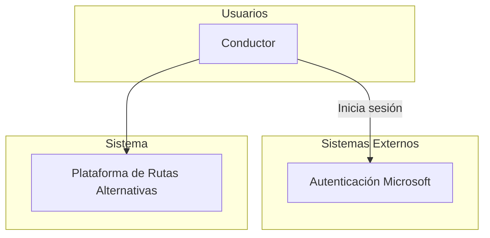
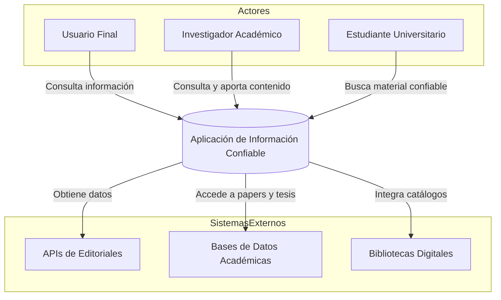

# Especificaciones de requisitos de software

**Proyecto: Plataforma para la gamificacion a traves del uso de rutas alternativas para la ciudad de Bogotá**

## Ficha del documento

| Fecha | Version | Autor | Verificado | Observaciones |
|-------|---------|-------|------------|---------------|
|       |         |       |            |               |

## Contenido

## 1 Introducción

TODO: Redactar un parrafo donde se de una introduccion al contenido de este documento

### 1.1 Propósito 

En este documento se define las espcificaciones funcionales y no funcionales de la plataforma de gamificacion sobre el uso de rutas alternativas para la ciudad de Bogotá. Este sera utilizado como guia para clientes y desarrolladores.

### 1.2 Alcance

### 1.3 Personal involucrado

| Nombre                  | Laura Alquichides                                                                    |
|-------------------------|--------------------------------------------------------------------------------------|
| Rol                     | Estudiante                                                                           |
| Categoría Profesional   | Ingeniería de Sistemas                                                               |
| Responsabilidad         | Diseñar, desarrollar e implementar el backend del sistema, incluido la base de datos |
| Información de contacto | lalquichides@ucompensar.edu.co                                                       |

### 1.4 Definiciones, acrónimos y abreviaturas

| Nombre  | Descripción                                          |
|---------|------------------------------------------------------|
| Usuario | Persona que usará el sistema para gestionar procesos |
| ERS     | Especificación de Requisitos Software                |
| RF      | Requerimiento Funcional                              |
| RNF     | Requerimiento No Funcional                           |

### 1.5 Referencias

### 1.6 Resumen

## 2 Descripcion general

### 2.1 Perspectiva del producto

### Diagrama de contexto

 
 
 
